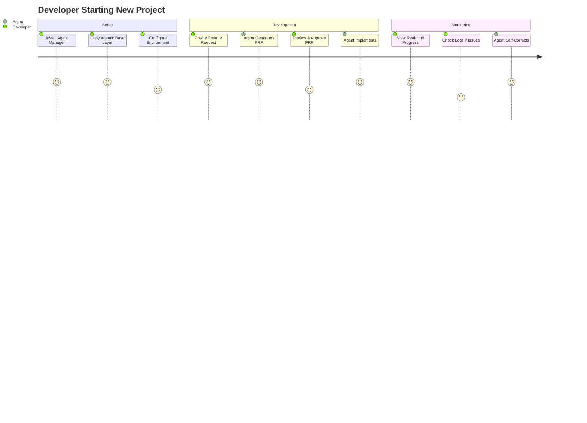

# Product Owner Analysis: Claude Agent Manager

## Executive Summary

The Claude Agent Manager is a comprehensive system designed to enable autonomous development through intelligent agent orchestration while providing real-time visibility into agent activities. The product combines an agentic base layer for rapid project initialization with a centralized monitoring tool for managing multiple Claude Code agents across an environment.

## 1. User Personas and Their Needs

### Primary Personas

#### 1.1 Solo Developer - "Alex"
- **Profile**: Independent developer working on multiple projects simultaneously
- **Technical Level**: Mid to senior level, comfortable with CLI tools
- **Pain Points**:
  - Loses context when switching between projects
  - Difficult to track what agents are doing across projects
  - Manual GitHub issue triage is time-consuming
  - Agent handoffs often lose critical context
- **Needs**:
  - Real-time visibility into all active agents
  - Automated issue prioritization
  - Context preservation for seamless project switching
  - Quick project initialization with best practices

#### 1.2 Team Lead - "Sarah"
- **Profile**: Engineering lead managing a team of 5-10 developers
- **Technical Level**: Senior level, focuses on architecture and productivity
- **Pain Points**:
  - No visibility into team's AI-assisted development
  - Inconsistent agent usage patterns across team
  - Difficult to enforce coding standards with AI agents
  - Cannot track AI tool effectiveness
- **Needs**:
  - Team-wide agent monitoring dashboard
  - Standardized agent configurations
  - Activity metrics and reporting
  - Quality gates and validation loops

#### 1.3 DevOps Engineer - "Mike"
- **Profile**: Responsible for CI/CD and development infrastructure
- **Technical Level**: Senior level, automation-focused
- **Pain Points**:
  - Agents don't integrate with existing CI/CD pipelines
  - No centralized logging for agent activities
  - Difficult to debug agent-related issues
  - Resource usage is unpredictable
- **Needs**:
  - Centralized log aggregation
  - API for CI/CD integration
  - Resource monitoring and limits
  - Deployment automation for agent configurations

#### 1.4 AI-First Developer - "Jordan"
- **Profile**: Early adopter pushing boundaries of AI-assisted development
- **Technical Level**: Senior level, experimental mindset
- **Pain Points**:
  - Limited by single-agent workflows
  - Cannot orchestrate complex multi-agent scenarios
  - Lacks tools for context engineering at scale
  - No way to share agent patterns with community
- **Needs**:
  - Multi-agent orchestration capabilities
  - Advanced context engineering tools
  - Agent template marketplace
  - Two-way communication with agents

## 2. Core Value Propositions

### 2.1 Primary Value: Autonomous Development Enablement
**"Transform your development workflow from manual coding to intelligent orchestration"**
- Reduce development time by 60-80% through automated implementation
- Maintain code quality through built-in validation loops
- Enable continuous development through agent handoffs

### 2.2 Secondary Values

#### Visibility & Control
- **Real-time Monitoring**: Know exactly what every agent is doing
- **Historical Context**: Never lose work context again
- **Team Oversight**: Manage agent usage across your organization

#### Productivity Multiplication
- **Parallel Development**: Run multiple agents on different features
- **Automated Triage**: Let agents prioritize your backlog
- **Context Preservation**: Seamless handoffs between work sessions

#### Quality Assurance
- **Built-in Validation**: Agents self-verify their work
- **Test-Driven Development**: Enforced TDD patterns
- **Code Standards**: Consistent quality across all agent work

## 3. MVP Feature Prioritization

### Phase 1: Foundation (Weeks 1-4)
**Goal**: Basic monitoring and agent registration

1. **Agent Registration & Heartbeat** (P0)
   - Justification: Core requirement for any monitoring
   - Enables: Basic visibility into active agents
   
2. **Real-time Status Dashboard** (P0)
   - Justification: Primary user need for visibility
   - Enables: Understanding of agent activities

3. **Log Aggregation & Viewing** (P0)
   - Justification: Essential for debugging and monitoring
   - Enables: Troubleshooting and audit trails

4. **Claude Code Hooks Integration** (P0)
   - Justification: Required for event capture
   - Enables: Automatic data collection

5. **Basic Agentic Base Layer** (P1)
   - Justification: Enables rapid project starts
   - Includes: .claude directory template with hooks

### Phase 2: Intelligence (Weeks 5-8)
**Goal**: Automated workflows and context preservation

6. **GitHub Issue Triage** (P1)
   - Justification: High-value automation for all personas
   - Enables: Automated backlog management

7. **Context Preservation System** (P1)
   - Justification: Critical for agent handoffs
   - Enables: Continuous development

8. **Agent History with Search** (P2)
   - Justification: Needed for debugging and learning
   - Enables: Pattern discovery and optimization

### Phase 3: Collaboration (Weeks 9-12)
**Goal**: Multi-agent orchestration

9. **Subagent Handoff Protocol** (P2)
   - Justification: Enables complex workflows
   - Enables: Team-based development patterns

10. **Work Progress Tracking** (P2)
    - Justification: Visibility into long-running tasks
    - Enables: Better resource planning

## 4. User Workflows and Journeys

### 4.1 Project Initialization Flow

### 4.2 Issue Triage Workflow
1. Developer runs `/feature-from-github-issue`
2. Agent fetches open issues from repository
3. Agent analyzes business value and effort
4. Agent creates sorted backlog with recommendations
5. Developer selects issue or accepts recommendation
6. Agent begins implementation with full context

### 4.3 Multi-Agent Handoff
1. Agent A reaches context limit or checkpoint
2. Agent A creates handoff document with:
   - Current state and progress
   - Remaining tasks
   - Key decisions and rationale
3. Agent B picks up work with full context
4. Manager tool tracks handoff and continuity

## 5. Success Metrics and KPIs

### 5.1 Adoption Metrics
- **Daily Active Agents**: Target 100+ by month 3
- **Projects Using Base Layer**: 80% of new projects
- **Issue Triage Adoption**: 60% of teams using GitHub integration

### 5.2 Productivity Metrics
- **Average Task Completion Time**: 50% reduction
- **Code Quality Score**: Maintain 90%+ test coverage
- **Context Loss Rate**: <5% of handoffs lose critical info

### 5.3 System Health Metrics
- **Agent Response Time**: <100ms for status updates
- **Log Processing Latency**: <1s end-to-end
- **Uptime**: 99.9% for monitoring service

### 5.4 Business Impact
- **Developer Hours Saved**: Track via task completion comparisons
- **Bug Introduction Rate**: Measure defects in agent-generated code
- **Feature Velocity**: Stories completed per sprint

## 6. Risk Assessment and Mitigation

### 6.1 Technical Risks

**Risk**: Claude Code API changes break integration
- **Impact**: High - Core functionality depends on hooks
- **Mitigation**: 
  - Version pin Claude Code
  - Abstract hook interface
  - Maintain compatibility layer

**Risk**: Redis memory exhaustion from retained histories
- **Impact**: Medium - Service degradation
- **Mitigation**:
  - Implement intelligent retention policies
  - Add memory monitoring and alerts
  - Support external storage backends

**Risk**: WebSocket connection instability
- **Impact**: Medium - Lost real-time updates
- **Mitigation**:
  - Implement reconnection logic
  - Queue events during disconnection
  - Fallback to polling

### 6.2 Adoption Risks

**Risk**: Learning curve too steep
- **Impact**: High - Low adoption
- **Mitigation**:
  - Comprehensive onboarding
  - Video tutorials
  - Template library

**Risk**: Developers don't trust agent work
- **Impact**: High - Product failure
- **Mitigation**:
  - Transparency in agent actions
  - Strong validation loops
  - Audit trails

### 6.3 Security Risks

**Risk**: Exposed API keys in agent configurations
- **Impact**: Critical - Security breach
- **Mitigation**:
  - Encrypted credential storage
  - Environment variable usage
  - Key rotation support

## 7. Dependencies and Integration Points

### 7.1 Core Dependencies
- **Claude Code CLI**: Version compatibility critical
- **Redis**: For state management (consider alternatives)
- **Node.js/TypeScript**: Runtime environment
- **React + rsbuild**: Frontend framework

### 7.2 External Integrations
- **GitHub API**: For issue management
- **Claude Code Hooks**: Event capture mechanism
- **WebSocket**: Real-time communication
- **File System**: Log and context storage

### 7.3 Optional Integrations
- **Slack/Discord**: Notifications
- **Datadog/Prometheus**: Metrics export
- **S3/GCS**: Long-term storage
- **OAuth Providers**: Team authentication

## 8. Post-MVP Roadmap

### Quarter 2: Scale & Performance
- **Distributed Architecture**: Support for multiple monitoring instances
- **Performance Analytics**: Agent efficiency metrics
- **Cost Tracking**: Token usage and optimization
- **Advanced Search**: Full-text search across all agent activities

### Quarter 3: Intelligence Layer
- **Pattern Recognition**: Identify common development patterns
- **Optimization Suggestions**: Recommend better agent strategies
- **Predictive Monitoring**: Anticipate agent issues
- **Auto-scaling**: Dynamic resource allocation

### Quarter 4: Ecosystem
- **Plugin System**: Extensible agent capabilities
- **Template Marketplace**: Share agent configurations
- **Enterprise Features**: SSO, audit, compliance
- **Multi-model Support**: Beyond Claude (GPT, Gemini, etc.)

### Future Vision
- **AI Development Platform**: Complete environment for AI-first development
- **Visual Orchestration**: Drag-drop agent workflow builder
- **Knowledge Base Integration**: Organizational memory for agents
- **Autonomous Teams**: Self-organizing agent swarms

## 9. Competitive Differentiation

### 9.1 Unique Advantages
- **Claude-Native**: Deep integration with Claude Code
- **Context Engineering Focus**: Not just monitoring, but optimization
- **Open Source Core**: Community-driven development
- **Developer-First**: Built by developers, for developers

### 9.2 Competitive Landscape
- **vs. Generic Monitoring**: Purpose-built for AI agents
- **vs. Manual Workflows**: 10x productivity improvement
- **vs. Other AI Tools**: Integrated ecosystem approach
- **vs. Enterprise Solutions**: Lightweight and developer-friendly

## 10. Go-to-Market Strategy

### 10.1 Launch Strategy
1. **Alpha**: Internal team + 10 beta users
2. **Beta**: 100 early adopters from Claude Code community
3. **GA**: Public launch with documentation and tutorials

### 10.2 Distribution
- **Primary**: Direct download from GitHub
- **Secondary**: Package managers (npm, homebrew)
- **Future**: Claude Code plugin marketplace

### 10.3 Community Building
- **Documentation**: Comprehensive guides and examples
- **Video Content**: YouTube tutorials and demos
- **Discord/Slack**: Active support community
- **Office Hours**: Weekly community calls

## Conclusion

The Claude Agent Manager represents a fundamental shift in how developers approach software creation. By combining autonomous development capabilities with comprehensive monitoring and management tools, we enable a new paradigm where developers become orchestrators rather than implementers. The MVP focuses on core visibility and automation features that provide immediate value, while the roadmap builds toward a future where AI agents handle the majority of implementation work under human guidance.

Success depends on nailing the developer experience, ensuring reliability, and building trust through transparency and quality. With proper execution, this tool can become the standard for AI-assisted development workflows.